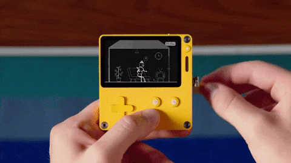
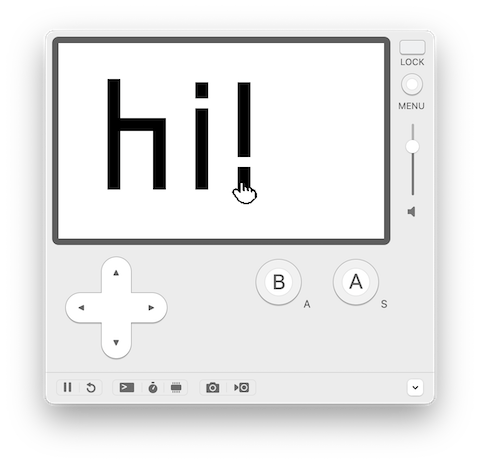

_I recently built a [Playdate game in Rust](https://github.com/missfunmi/tictactoe-playdate/). I thought I'd share the process for anyone else considering doing the same thing._

[Playdate](https://play.date) is a handheld gaming console that launched in 2019. Its most recognizable feature is a fun little crank that many (but not all) games incorporate into their gameplay in really creative and sometimes funny ways.



I've personally never really been a big gamer, but I love the peppy, bright yellow colorway of the Playdate and its quirky form factor. Separately, I recently became interested in learning Rust, and I wanted to do so by building something practical in addition to going through the Rust book.

While Rust is not officially supported by Playdate, there are unofficial libraries that facilitate Playdate game development in Rust, so I thought I'd try my hand at one of them. I chose to use the [crankstart](https://github.com/pd-rs/crankstart) crate, mostly because it was the first one I came across and it's been around the longest. Since it's an unofficially maintained library, feature-wise it's several versions behind the official Playdate SDK, but it's still totally functional for basic/core game functions.

>> **💡 Note:** The code in this game works with Playdate SDK v2.6.2. It will probably also work with the [latest SDK v2.7](https://sdk.play.date/changelog/#_2_7_0), but I've not tested that yet!

## Goals

For this exercise, we're going to build a game that has a player that can be moved around the screen via the keypad. Pressing the `A` button on the Playdate will put a dot on the screen at the player's current location, and pressing the `B` button will clear the screen of all dots. A very simplistic drawing "game", if you will. You can view the complete source code here: https://github.com/missfunmi/hello-world-playdate



## Pre-requisites

1. [**Rust**](https://www.rust-lang.org/) → If you're here, you probably already have this installed. If not, I recommend installing via [Rustup](https://www.rust-lang.org/tools/install).
   - **cargo** → This is automatically installed for you by Rustup
   - **Rust nightly toolchain** → Building games for devices uses non-standard Rust features, which is only available on the nightly toolchain. Install by running `rustup toolchain install nightly`. This makes the nightly toolchain available on your system but does not change your global Rust version to the nightly one.
2. [**Playdate SDK**](https://play.date/dev/) → Download v2.6.2 from [here](https://download-cdn.panic.com/playdate_sdk/) for your relevant OS.
   - Follow the [Installation steps](https://sdk.play.date/2.6.2/Inside%20Playdate.html#_installation) to complete the process. Be sure to update your `PATH` variable to include the Playdate SDK by following the instructions [here](https://sdk.play.date/2.6.2/Inside%20Playdate.html#_set_playdate_sdk_path_environment_variable).
   - Feel free to poke around the downloaded SDK to see what it comes with. You can even try running some of the sample games (written in Lua) that come with the SDK! The Playdate Simulator is automatically installed for you as well.
3. [**crank**](https://github.com/pd-rs/crank) → This is the command line tool that will build your game into a Playdate binary.
   - Install according to the instructions on [GitHub](https://github.com/pd-rs/crank). If you've already installed Rust and the Playdate SDK, you'll only need to run the following command additionally: `cargo install --git=https://github.com/pd-rs/crank`

## Setting up your project

In your project directory, run:

```bash
cargo new --lib hello-world-playdate
```

You can now open the `hello-world-playdate` project in your IDE of choice. I personally like [RustRover](https://www.jetbrains.com/rust/), which is free for non-commercial use.

To use Rust nightly in this project without overriding your global Rust version, create a file in the project root called `rust-toolchain.toml` and add the following entry:

```toml
# File: rust-toolchain.toml

[toolchain]
channel = "nightly"
```

There are a few tweaks you need to make to the auto-generated `Cargo.toml` for your Playdate game:

```toml
# File: Cargo.toml

[package]
name = "hello-world-playdate"
version = "0.1.0"
edition = "2018"

[package.metadata.cargo-xbuild]
memcpy = false
sysroot_path = "target/sysroot"
panic_immediate_abort = false

[profile.dev]
panic = "abort"
opt-level = 'z'
lto = true

[profile.release]
panic = "abort"
opt-level = 'z'
lto = true

[lib]
crate-type = ["staticlib", "cdylib"]

[dependencies]
crankstart = { git = "https://github.com/pd-rs/crankstart.git", rev = "2d2e99c" }
crankstart-sys = { git = "https://github.com/pd-rs/crankstart.git", rev = "2d2e99c" }
anyhow = { version = "1.0.98", default-features = false }
euclid = { version = "0.22.11", default-features = false, features = ["libm"] }
```

Let's cover some of the changes we've made here:

1. `edition = "2018"`: I haven't tested with [Rust 2024](https://doc.rust-lang.org/stable/edition-guide/rust-2024/index.html), but feel free to — it might work!
2. `package.metadata.cargo-xbuild`: These settings override some default build behavior so that crankstart and crank can manage things differently when targeting the Playdate.
3. `[profile.dev]` and `[profile.release]`: These settings make your build smaller and more suitable for tiny systems like the Playdate.
4. `crate-type = ["staticlib", "cdylib"]`: This compiles your game as both a static library and a C-compatible dynamic library, which is necessary because the Playdate system can only load and run compiled C-compatible code.
5. `crankstart` and `crankstart-sys`: These are the core libraries that let you build your Playdate game in Rust. We pin them to a [specific commit](https://github.com/pd-rs/crankstart/commit/2d2e99c89326d16b3ee6b465bdfea39c1a25d8ce) that includes important fixes not yet published to crates.io.
6. `anyhow` and `euclid`: These are optional helper crates we'll use in our game. We disable default features because we'll be building in a `no_std` environment which does not support them (more on `no_std` below).

## Setting up your game template

Create a `Crank.toml` file at the same level as your auto-generated `Cargo.toml` containing the following configuration:

```toml
# File: Crank.toml

[[target]]
name = "hello_world_playdate"
assets = [
    "assets/background.png",
    "assets/dot.png",
    "assets/player.png",
]

[target.metadata]
name = "Hello World"
version = "0.1.0"
author = "<your name>"
bundle_id = "com.example.hello_world"
description = "A simple interactive Playdate game built in Rust"
```

These properties map to the Playdate metadata defined [here](https://sdk.play.date/2.6.2/#pdxinfo), so you can refer to that documentation for information on what each property does. Note that due to [an open issue in the crankstart library](https://github.com/pd-rs/crankstart/issues/89), hyphens will not work in the target name in `Crank.toml` (this is not a limitation in Playdate itself).

Next, create the `assets` folder at the same level as your `src` folder and populate this folder with the contents of the assets folder in the [project repository](https://github.com/missfunmi/hello-world-playdate/tree/master/assets).

Open `src/lib.rs` file and replace its contents with the template below:

```rust
// File: src/lib.rs

#![no_std]

extern crate alloc;
use alloc::boxed::Box;
use anyhow::Error;
use crankstart::sprite::Sprite;
use crankstart::{crankstart_game, Game, Playdate};
use crankstart_sys::PDRect;

struct HelloWorldGame {}

impl HelloWorldGame {
    pub fn new(_playdate: &Playdate) -> Result<Box<Self>, Error> {
        todo!()
    }
}

impl Game for HelloWorldGame {
    fn update_sprite(&mut self, sprite: &mut Sprite, _playdate: &mut Playdate) -> Result<(), Error> {
        todo!()
    }

    fn draw_sprite(&self, sprite: &Sprite, _bounds: &PDRect, _draw_rect: &PDRect, _playdate: &Playdate) -> Result<(), Error> {
        todo!()
    }

    fn update(&mut self, _playdate: &mut Playdate) -> Result<(), Error> {
        todo!()
    }
}

crankstart_game!(HelloWorldGame);
```

This is the bare minimum for what your game needs to launch. We'll populate the `todo()!`'s with real game logic shortly, but first, let's talk about what's happening here:

1. `#![no_std]`: This tells Rust to exclude the use of its standard library, [libstd](https://doc.rust-lang.org/std/) when compiling your game. This is required when writing applications for embedded systems like a gaming console. Don't ask me why — I'm just the messenger. You can read more about `no_std` [here](https://docs.rust-embedded.org/book/intro/no-std.html).
2. `extern crate alloc` and `use alloc::boxed::Box`: These enable heap allocation via `Box`, a smart pointer in Rust to heap memory in your `no_std` environment. Since you can't always know the exact size or lifetime of your game state ahead of time, `crankstart` (and your game) use `Box` to store data on the heap instead of the limited stack.
3. `struct HelloWorldGame` and `impl HelloWorldGame`: This is your singleton game object, where you'll implement all your game logic: instantiating graphics and text, spawning entities, managing game state, and so on. Your game must define a `pub fn *new*(_playdate: &Playdate) -> Result<Box<Self>, Error>` function that takes the [Playdate](https://github.com/pd-rs/crankstart/blob/main/src/lib.rs?rev=2d2e99c#L35) object as an argument and returns a boxed instance of your game. This is how `crankstart` initializes and kicks off your game flow.
4. `impl Game for HelloWorldGame`: [Game](https://github.com/pd-rs/crankstart/blob/main/src/lib.rs?rev=2d2e99c#L102) is the main trait from `crankstart` that defines how your game updates in response to state changes (typically by rendering stuff to the screen). In particular, `fn update(&mut self, playdate: &mut Playdate)` maps directly to [playdate.update()](https://sdk.play.date/2.6.2/Inside%20Playdate.html#c-update), which the Playdate system calls [30 times per second](https://sdk.play.date/2.6.2/Inside%20Playdate.html#_playdate_specifications) by default. There are some additional trait functions that your game can optionally implement. For convenience, I've left them out of this post, but feel free to look through the crate's source to read through the others.
5. `crankstart_game!(HelloWorldGame)`: This macro kicks off your game flow by telling `crankstart` which game struct to use. You can place it anywhere in your Rust project, but it's idiomatic (from what I can see) to put it at the bottom after all your game logic.

Now let's try running the game. In your terminal, from your project root, run the command:

```bash
cd hello-world-playdate/    # If you haven't already done that
crank run --release
```

We use the crank CLI we installed earlier to compile the game into a Playdate binary and launch it on the simulator. The `--release` flag merely optimizes your game build. Right now, running this command may only briefly launch the simulator before immediately crashing. This is because we don't actually have any logic implemented in our game, so there's nothing (yet) for the simulator to render.

## Writing your game logic

Now that we've squared away the basics, let's implement some actual game logic.

### Loading the background image

We'll start by loading the background image onto the screen. First, we'll define an enum for the different types of sprites our game will have, which is just `Background` for now:

```rust
// File src/lib.rs

#[repr(u8)]
enum SpriteType {
    Background = 0,
}

impl From<u8> for SpriteType {
    fn from(tag: u8) -> Self {
        let sprite_type = match tag {
            _ => Background
        };
        sprite_type
    }
}
```

Next, we'll attach the background image to the game instance and instantiate the image as well as the containing sprite:

```rust
// File src/lib.rs

const SCREEN_WIDTH: f32 = 400.0;
const SCREEN_HEIGHT: f32 = 240.0;

struct HelloWorldGame {
    background_image: Bitmap
}

impl HelloWorldGame {
    pub fn new(_playdate: &Playdate) -> Result<Box<Self>, Error> {
        let sprite_manager = SpriteManager::get_mut();

        // Load the background
        let background_image = Graphics::get().load_bitmap("assets/background")?;
        let background = Box::leak(Box::new(sprite_manager.new_sprite()?));
        background.set_bounds(&rect_make(0.0, 0.0, SCREEN_WIDTH, SCREEN_HEIGHT))?;
        background.set_use_custom_draw()?;
        background.set_z_index(0)?;
        background.set_tag(Background as u8)?;
        sprite_manager.add_sprite(background)?;

        let game = HelloWorldGame { background_image };
        Ok(Box::new(game))
    }
}
```

[Box::leak](https://doc.rust-lang.org/std/boxed/struct.Box.html#method.leak) is a handy feature in Rust that lets the game keep a reference to the background sprite and prevents Rust from deallocating it. We set the background image to start from coordinates `(0, 0)` and span the [width and height](https://sdk.play.date/2.6.2/#_playdate_specifications) of the Playdate screen.

Lastly, we'll tell the Playdate to actually draw the background image on screen. We only want to draw the background image once since it won't change during the game play in this specific game, so we'll use the `draw_sprite` trait function to do so:

```rust
// File src/lib.rs

impl Game for HelloWorldGame {
    fn update_sprite(&mut self, sprite: &mut Sprite, _playdate: &mut Playdate) -> Result<(), Error> {
        Ok(())
    }

    fn draw_sprite(&self, sprite: &Sprite, _bounds: &PDRect, _draw_rect: &PDRect, _playdate: &Playdate) -> Result<(), Error> {
        let tag = sprite.get_tag()?.into();
        match tag {
            Background => self.background_image.draw(point2(0, 0), LCDBitmapFlip::kBitmapUnflipped)?,
            _ => {}
        }
        Ok(())
    }

    fn update(&mut self, _playdate: &mut Playdate) -> Result<(), Error> {
        Ok(())
    }
}
```

Be sure to swap out the `todo!()` placeholders in the other 2 trait functions with `Ok(())`, otherwise Playdate will continue to crash when you try to launch the game. We'll add in the logic for these later.

Now re-run `crank run --release` — you should now see the Playdate simulator launch with our background image loaded. Neat!

### Adding the player

Initializing the player sprite is very similar to how we initialized the background sprite:

```rust
// File src/lib.rs

#[repr(u8)]
enum SpriteType {
    Background = 0,
    Player = 1
}

impl From<u8> for SpriteType {
    fn from(tag: u8) -> Self {
        let sprite_type = match tag {
            0 => Background,
            _ => Player,
        };
        sprite_type
    }
}

struct HelloWorldGame {
    background_image: Bitmap,
    player: Sprite,
}

impl HelloWorldGame {
    pub fn new(_playdate: &Playdate) -> Result<Box<Self>, Error> {
        let sprite_manager = SpriteManager::get_mut();

        // Load the background as before
        ...

        // Load the player
        let player_image = Graphics::get().load_bitmap("assets/player")?;
        let mut player = sprite_manager.new_sprite()?;
        player.set_image(player_image, LCDBitmapFlip::kBitmapUnflipped)?;
        player.move_to(200.0, 120.0)?;
        player.set_z_index(10)?;
        player.set_opaque(true)?;
        player.set_tag(Player as u8)?;
        sprite_manager.add_sprite(&player)?;

        let game = HelloWorldGame { background_image, player };
        Ok(Box::new(game))
    }
}
```

We add a new `Player` tag to the `SpriteType` enum, then initialize the player and position it in the center of the screen at the `(x, y, z)` coordinates: `(200.0, 120.0, 10)`. You can choose any value you want for the z-index as long as it's greater than that of the background to ensure its positioned on top of the background. Instead of using custom draw, we attach the image to the player sprite directly since unlike our background, we expect to move the player around on the screen.

Notice here that we're adding the `player` sprite to the game instance instead of using `Box::leak`. This is because we'll need to access the player's coordinates in the `Game` trait later when we add dots to the screen.

Re-run `crank run --release` to see your player appear on the simulator!

### Moving the player around the screen

To move the player around the screen, we'll detect keyboard presses on every frame and move the player to the corresponding location. This requires adding logic to the `update_sprite` function, which as you'll recall is triggered by Playdate at the game's frame rate:

```rust
// File src/lib.rs

const MOVE: f32 = 2.0;                    // We'll let the player move 2 pixels at a time
const PLAYER_SPRITE_WIDTH: f32 = 32.0;    // Width in pixels of player.png
const PLAYER_SPRITE_HEIGHT: f32 = 32.0;   // Height in pixels of player.png

impl Game for HelloWorldGame {
    fn update_sprite(&mut self, sprite: &mut Sprite, _playdate: &mut Playdate) -> Result<(), Error> {
        let tag = sprite.get_tag()?.into();
        match tag {
            Player => {
                let (current, _pushed, _released) = System::get().get_button_state()?;
                let current_position = sprite.get_position()?;
                let mut new_position = current_position.clone();

                if (current & PDButtons::kButtonUp) == PDButtons::kButtonUp {
                    new_position.1 -= MOVE;
                }
                if (current & PDButtons::kButtonDown) == PDButtons::kButtonDown {
                    new_position.1 += MOVE;
                }
                if (current & PDButtons::kButtonLeft) == PDButtons::kButtonLeft {
                    new_position.0 -= MOVE;
                }
                if (current & PDButtons::kButtonRight) == PDButtons::kButtonRight {
                    new_position.0 += MOVE;
                }

                new_position.0 = new_position.0.clamp(0.0+PLAYER_SPRITE_WIDTH/2.0, SCREEN_WIDTH-PLAYER_SPRITE_WIDTH/2.0);
                new_position.1 = new_position.1.clamp(0.0+PLAYER_SPRITE_HEIGHT/2.0, SCREEN_HEIGHT-PLAYER_SPRITE_HEIGHT/2.0);

                sprite.move_to(new_position.0, new_position.1)?;
            }
            _ => {}
        }

        sprite.mark_dirty()?;
        Ok(())
    }

    // other functions as before
}
```

Here, we detect what key the player is _currently_ pressing and move the player around the screen 2 pixels at a time, clamping the player's position so it doesn't go offscreen. Note we halve the player's dimensions when calculating its position relative to the screen bounds because Playdate anchors sprite positions at the center by default.

### Adding and clearing dots on the screen

The last thing we'll do is insert a dot on the screen when the Playdate's `A` button is pressed and clear the entire screen of all dots when the `B` button is pressed. To do this, we'll initialize our final game asset: `dot.png` on game load, but only create and show a new dot sprite on screen when the `A` button is pressed:

```rust
// File src/lib.rs

#[repr(u8)]
enum SpriteType {
    Background = 0,
    Player = 1,
    Dot = 2
}

impl From<u8> for SpriteType {
    fn from(tag: u8) -> Self {
        let sprite_type = match tag {
            0 => Background,
            1 => Player,
            _ => Dot
        };
        sprite_type
    }
}

struct HelloWorldGame {
    background_image: Bitmap,
    player: Sprite,
    dot_image: Bitmap,
    dots: Vec<Sprite>,
}

impl HelloWorldGame {
    pub fn new(_playdate: &Playdate) -> Result<Box<Self>, Error> {
        let sprite_manager = SpriteManager::get_mut();

        // Load the background and player as before
        ...

        // Load the dot
        let dot_image = Graphics::get().load_bitmap("assets/dot")?;
        let dots = Vec::new();

        let game = HelloWorldGame {
            background_image,
            player,
            dot_image,
            dots,
        };
        Ok(Box::new(game))
    }
}

impl Game for HelloWorldGame {
    fn update(&mut self, _playdate: &mut Playdate) -> Result<(), Error> {
        let (current, pushed, _) = System::get().get_button_state()?;

        if (current & PDButtons::kButtonA) == PDButtons::kButtonA {
            let sprite_manager = SpriteManager::get_mut();
            let player_position = self.player.get_position()?;
            let mut dot = sprite_manager.new_sprite()?;
            dot.set_image(self.dot_image.clone(), LCDBitmapFlip::kBitmapUnflipped)?;
            dot.move_to(player_position.0, player_position.1-PLAYER_SPRITE_HEIGHT/2.0)?;
            dot.set_z_index(5)?;
            dot.set_opaque(true)?;
            dot.set_tag(Dot as u8)?;
            sprite_manager.add_sprite(&dot)?;
            self.dots.push(dot);
        } else if (pushed & PDButtons::kButtonB) == PDButtons::kButtonB {
            self.dots.clear();
        }

        Ok(())
    }

    // other functions as before
}
```

Re-run `crank run --release` to see your fully functioning game on the simulator!

And that's it!

---

Naturally, this only covers a very small fraction of what's actually possible with Playdate and the crankstart crate. Our game doesn't even use the crank or do anything with music, so feel free to play around and expand it as you like. You're also welcome to contribute enhancements to the crankstart library to enable other Rust developers to build Playdate games. If you do, feel free to [drop me a note](/about#say-hi) to let me know!
